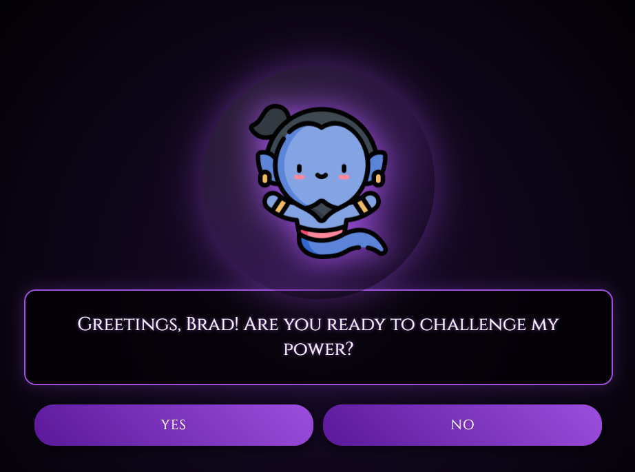

# AI Mind Reader (Akinator Clone)

A mystical, AI-powered guessing game that attempts to read your mind! Inspired by Akinator, this application uses Google's Gemini AI with real-time voice and text streaming to create an immersive, interactive experience. Choose from multiple mystical personas, each with their own unique voice and personality, as they try to guess the character you're thinking of.



## Features

*   **Real-Time Voice Streaming**: The AI speaks to you using Gemini's native audio streaming with natural-sounding voices - no delay, no waiting!
*   **Live Text Streaming**: Watch the AI's responses appear character-by-character as they think and speak.
*   **Multiple Personas**: Choose from 5 unique characters, each with distinct personalities and voices:
    *   **The Demon** - Dark, menacing, and arrogant (Enceladus voice)
    *   **The Genie** - Mysterious and mystical (Enceladus voice)
    *   **The Wizard** - Wise and scholarly (Orus voice)
    *   **The Fortune Teller** - Enigmatic and spiritual (Aoede voice)
    *   **The Monster** - Moody and grouchy (Algenib voice)
*   **Emotional AI Responses**: The AI reacts emotionally to your answers - getting excited when you say "Yes" and frustrated when you say "No".
*   **Smart Question Logic**: Uses `gemini-2.5-flash-native-audio-preview` to generate intelligent yes/no questions.
*   **Customizable Game Settings**: Set your name and adjust the question limit (5-50 questions).
*   **Immersive UI**: Dark, mystical theme with floating animations, glowing effects, and a crystal ball.

## Prerequisites

*   Python 3.9 or higher
*   A Google Gemini API Key

## Installation

1.  **Clone the repository** (or navigate to the project folder):
    ```bash
    cd c:\projects\games\akinator
    ```

2.  **Install dependencies**:
    ```bash
    pip install -r requirements.txt
    ```

## Configuration

1.  Create a file named `key.txt` in the root directory.
2.  Add your Google Gemini API key to the file in the following format:
    ```env
    GOOGLE_GEMINI_API_KEY=your_api_key_here
    ```

## Running the Game

1.  **Start the server**:
    ```bash
    python main.py
    ```

2.  **Open the game**:
    Open your web browser and navigate to:
    [http://127.0.0.1:8000](http://127.0.0.1:8000)

## How to Play

1.  **Choose Your Settings**: Click the gear icon to set your name and preferred number of questions (default: 20).
2.  **Select a Persona**: Choose from The Demon, Genie, Wizard, Fortune Teller, or Monster.
3.  **Think of a Character**: Pick any real or fictional character in your mind.
4.  **Answer Questions**: The AI will ask yes/no questions - answer using the buttons:
    *   **Yes** / **No** - Definitive answers
    *   **Probably** / **Probably Not** - When you're unsure
    *   **Don't Know** - When the question doesn't apply
5.  **Experience the Magic**: Listen to the AI speak with streaming audio and watch their personality shine through!
6.  **The Finale**: The AI will make a guess - were they right?

## Project Structure

*   `main.py`: FastAPI backend server handling game logic and API calls.
*   `templates/index.html`: The main game interface.
*   `static/style.css`: Custom styling and animations.
*   `static/script.js`: Frontend logic and audio playback handling.
*   `requirements.txt`: List of Python dependencies.
*   `key.txt`: Configuration file for API keys (not included in version control).

## Technologies Used

*   **Backend**: Python, FastAPI, Uvicorn, WebSockets
*   **AI**: Google Gemini API (`gemini-2.5-flash-native-audio-preview`) with Live API for real-time streaming
*   **Audio**: Native PCM audio streaming with multiple prebuilt voices
*   **Frontend**: HTML5, CSS3, JavaScript (Web Audio API for real-time playback)
